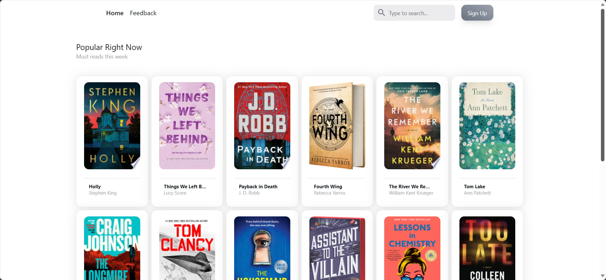
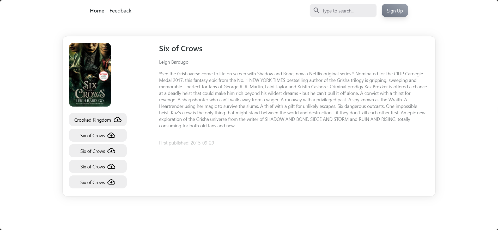

# ReactLibgen

ReactLibgen is a web application built with React and Node.js that aims to provide an improved experience for searching and downloading books from Libgen (Library Genesis). With ReactLibgen, users can easily search for books, view book details, and download them with just a few clicks.




## Features

- Search: Users can enter keywords or specific book titles to search for books available on Libgen.
- Book Details: Detailed information about each book, such as title, author, publication year, and description, is displayed on the book details page.
- Download: Users can download books directly from Libgen with a simple download button.
- User-Friendly Interface: The React-based frontend provides a responsive and intuitive interface for seamless browsing and interaction.

## Technologies Used

- React: A JavaScript library for building user interfaces.
- Node.js: A JavaScript runtime environment for executing server-side code.
- Express: A lightweight web application framework for Node.js used to handle backend API requests.
- Axios: A promise-based HTTP client for making HTTP requests from the Node.js server.
- Cheerio: A fast and flexible library for web scraping in Node.js, used to scrape book data from Libgen.

## Setup and Installation

### Frontend

````
1. Clone the repository:

   ```shell
   git clone https://github.com/your-username/react-libgen.git
````

2. Navigate to the frontend directory:

   ```shell
   cd react-libgen/frontend
   ```

3. Install frontend dependencies:

   ```shell
   npm install
   ```

4. Start the frontend development server:

   ```shell
   npm start
   ```

5. Open your web browser and navigate to `http://localhost:3000` to access the ReactLibgen frontend.

### Backend

1. In a separate terminal window, navigate to the backend directory:

   ```shell
   cd react-libgen/backend
   ```

2. Install backend dependencies:

   ```shell
   npm install
   ```

3. Start the backend server:

   ```shell
   npm start
   ```

The backend server will run on `http://localhost:8000` by default.
